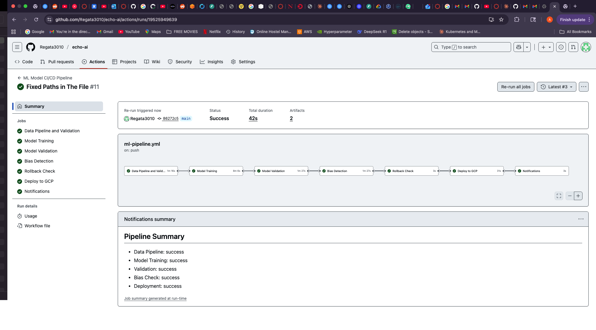

# EchoAI Model Development- MLOps Assignment

## Team Members
- Abhisek Mallick
- Arav Pandey
- Srinivasan Raghavan
- Nidhi Mallikarjun
- Ragul Narayanan Magesh

## Project Overview
Data pipeline implementation for the EchoAI review processing system, demonstrating MLOps best practices including data versioning (DVC), pipeline orchestration (Airflow DAG), bias detection, and anomaly detection.

## Repository Structure
```
echo-ai/
├── Data-Pipeline/
│   ├── dags/                 # Airflow DAG definitions
│   │   └── review_pipeline_dag.py
│   ├── scripts/              # Pipeline modules
│   │   ├── generate_data.py
│   │   ├── data_acquisition.py
│   │   ├── preprocessing.py
│   │   ├── feature_engineering.py
│   │   ├── validation.py
│   │   ├── bias_detection.py
│   │   └── anomaly_detection.py
│   ├── tests/                # Unit tests
│   │   ├── test_preprocessing.py
│   │   ├── test_validation.py
│   │   └── test_edge_cases.py
│   └── configs/              # Configuration files
├── data/
│   ├── raw/                  # Raw data (DVC tracked)
│   ├── processed/            # Processed data (DVC tracked)
│   └── metrics/              # Validation metrics
├── docs/                     # Documentation and reports
├── run_pipeline.py           # Alternative pipeline orchestrator
├── dvc.yaml                  # DVC pipeline configuration
└── requirements.txt          # Python dependencies
```

## Quick Start

### 1. Clone Repository
```bash
git clone https://github.com/YOUR_USERNAME/echo-ai.git
cd echo-ai
```

### 2. Install Dependencies
```bash
pip install -r requirements.txt
```

### 3. Get Data with DVC
```bash
dvc pull  # Downloads tracked data files
```

### 4. Run Pipeline
```bash
# Option 1: Direct Python execution (recommended)
python3 run_pipeline.py

# Option 2: Using Airflow (requires Python 3.9-3.11)
airflow db init
airflow dags trigger review_processing_pipeline
```

## Pipeline Components

### Data Acquisition
- Generates 5000 synthetic reviews with realistic distributions
- Simulates Google Reviews API data structure

### Preprocessing
- Text cleaning and normalization
- Missing value handling
- Feature extraction (text length, word count)

### Validation
- Schema validation
- Data type checking
- Range validation for ratings (1-5)
- Missing value detection

### Bias Detection
- Rating distribution analysis
- Category-wise bias detection
- Text length correlation analysis
- Generates bias report in `docs/bias_report.md`

### Anomaly Detection
- Outlier detection using IQR and Z-score methods
- Duplicate detection
- Suspicious pattern identification
- Alert generation for critical anomalies

## Data Versioning with DVC
```bash
# Track new data files
dvc add data/raw/synthetic_reviews.csv

# Push to remote storage
dvc push

# Pull latest data version
dvc pull
```

## Testing
```bash
# Run all tests
pytest Data-Pipeline/tests/ -v

# Run specific test module
python3 Data-Pipeline/tests/test_preprocessing.py
```

## Evaluation Criteria Met
- ✅ Proper Documentation
- ✅ Modular Syntax and Code
- ✅ Pipeline Orchestration (Airflow DAG)
- ✅ Tracking and Logging
- ✅ Data Version Control (DVC)
- ✅ Schema and Statistics Generation
- ✅ Anomaly Detection and Alerts
- ✅ Bias Detection and Mitigation
- ✅ Test Modules
- ✅ Reproducibility
- ✅ Error Handling

## Known Issues
- Airflow requires Python 3.9-3.11. For Python 3.13, use `run_pipeline.py` as alternative orchestrator.
- DVC remote storage requires configuration for team collaboration.

## Future Enhancements
- Integration with real Google Reviews API
- Advanced NLP features for sentiment analysis
- Real-time streaming with Apache Kafka
- Model training pipeline integration

## Contact
For questions about this pipeline, please contact the team through the GitHub repository issues.

## Screenshots

